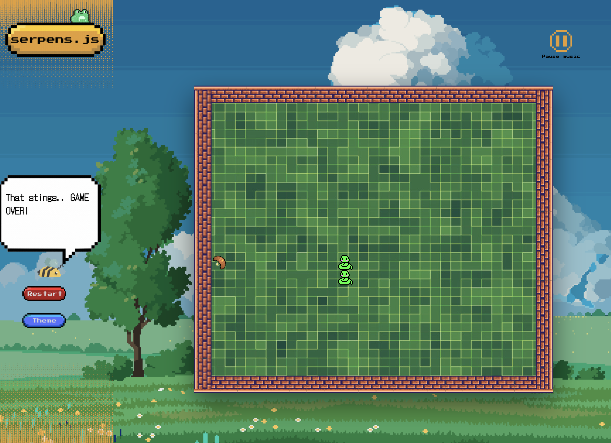

# serpens.js

## Description

Serpens.js is a version of the classic snake arcade game. Please review [the readme in an earlier repo for a version of the game](https://github.com/dp-daly/js-snake) that ran solely in the browser.

In this repo, I am extending the game to include a rails backend. Functionality will include:
- A multi-page app, in contrast to the single page browser game
- Incorporation of rails' stimulus.js framework for an improved UI
- RSpec testing for backend ruby code, and Jest/Mocha testing for frontend javascript
- Feature: create a profile
- Feature: save and view scores
- Feature: high score view in gameplay
- Feature: leaderboard
- Feature: additional levels to gameplay

### Access

For now, you can play the browser version of the game in your computer browser here: https://dp-daly.github.io/js-snake/

## Technology

### Stack
- Ruby on Rails v8, including stimulus.js
- RSpec
- Jest/Mocha
- Devise

### Languages
- Javascript
- HTML
- CSS
- Capybara

## Improvements

Future improvements may include: 

* Optimisation for smartphones and tablets: this remains a browser game with backend functionality.

* Tailored character text and sound effects for the alternative theme.

* Additional visual cues for game over, such as flashing sprites and red animated text in the console to add emphasis.

## Acknowledgments

Pixel art background illustrations for both themes from craftpix.net, granted with royalty free usage in unlimited projects.

Snake sprite from anyrgb.com. 

Alien sprite and other graphics created on canva.com. 

Background music and sound effects from zapsplat.com.